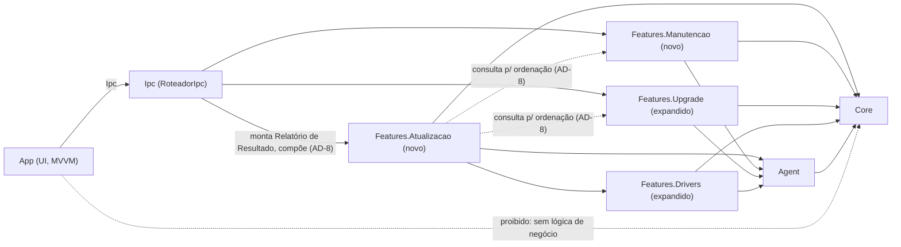

# Architecture Spine — Módulo de Sugestão de Upgrade com Foco em Custo-Benefício

## Design Paradigm

**Modular monolith, vertical-slice por feature**, já em uso no `otimizacao` e ratificado aqui, não reinventado:

- `Core` — domínio puro (`Inventario`, enums, contratos, `Resultado<T>`). Sem I/O de plataforma.
- `Agent` — I/O real de plataforma (WMI/CIM, sensores, pnputil, Event Log), roda no processo privilegiado.
- `Features.*` — uma fatia vertical por capacidade de produto, referencia `Core` e, quando precisa de I/O real, `Agent`.
- `Ipc` — fronteira única entre o processo privilegiado (`Agent`/`WindowsService`) e a UI (`App`, Avalonia/MVVM), via named pipes e dispatch por string de `Metodo` (`RoteadorIpc`).
- `Cerebro` — cliente LLM, consumido só onde já é consumido hoje (chat de upgrade); este PRD não expande o uso de LLM.

Este módulo não introduz um paradigma novo — estende o existente com três fatias: `Features.Upgrade` (existente, expandida), `Features.Drivers` (existente, expandida) e duas fatias novas (`Features.Atualizacao`, `Features.Manutencao`).

## Invariants & Rules



### AD-1 — Nenhuma feature nova reinventa aprovação/rollback `[ADOPTED]`

- **Binds:** FR-4 (aprovação obrigatória), FR-6, FR-7
- **Prevents:** um segundo mecanismo de consentimento/rollback divergente de `ExecutorControlado`/`ServicoBackup`
- **Rule:** toda ação mutante nova (driver, software, futura config) declara `PreCondicoes` e passa por `ExecutorControlado.AplicarPerfilAsync`; nenhuma feature chama `pnputil`, grava registro ou aplica config fora desse caminho. BIOS nunca é gravada pelo app — `ModuloBios`/`GeradorGuiaBios` continuam só orientando (já é assim no código).

### AD-2 — Features.Upgrade é a única fonte de sugestão de upgrade

- **Binds:** FR-12 a FR-19
- **Prevents:** a divergência atual entre `Features.Upgrade` (testado, com validação) e a lógica hardcoded em `UpgradeViewModel`
- **Rule:** `UpgradeViewModel` não pode conter catálogo, regra de compatibilidade ou cálculo de ganho próprios — consome exclusivamente `ValidadorCompatibilidade`/`GeradorSugestoes`/`CalculadoraGargalo` (ou seus sucessores). Qualquer novo dado de peça (RAM, SSD) entra pelo catálogo de `Features.Upgrade`, nunca por um switch novo na ViewModel.

### AD-3 — Papel fixo de cada fonte de dados de hardware

- **Binds:** FR-1, FR-2, FR-12, FR-13, FR-14, FR-19
- **Prevents:** uma quarta fonte de dados aparecer ad-hoc, ou uma fonte assumir papel de outra sem decisão explícita
- **Rule:**
  - **TechPowerUp** → única fonte do ganho estimado/benchmark (FR-19, alimenta FR-14). Sem cobertura = omite o número (já é regra do PRD). `[ADOPTED]` V1 usa a camada gratuita (itens em destaque/geração atual) — dataset completo exige contrato comercial sem preço público, fora de escopo por ora. Cobertura mais estreita é aceitável (mesmo princípio de AD-9 para o catálogo de compatibilidade).
  - **Catálogo estático curado** (`hardware_catalog.json`, hoje ~15 peças) → única fonte de compatibilidade física (socket, RAM, PSU headroom) até ganhar uma fonte melhor; seu crescimento/curadoria fica deferred.
  - **BuildCores Open DB** → só alimenta o chat do `AgenteUpgrade`; nunca é fonte de um FR do produto.
  - **RepositorioWhqlEstatico** (driver) e `BancoCuradoBios` (BIOS) → tratados como seed temporário de FR-1/FR-2, substituídos por consulta a fonte oficial real (AD-4), não por TechPowerUp.
  - `GanhoEstimado { Percentual, MargemConfianca, AtualizadoEm }` (`Core`) é o contrato único para **as duas linhas** do Relatório de Resultado — trilha paga (TechPowerUp) **e** trilha grátis (`Otimização do S.O. = X%`). A fonte da trilha grátis não está decidida nesta espinha (candidato natural é `CalculadoraScore`, que hoje calcula nota de saúde 0-100, não ganho percentual previsto — precisa de extensão ou cálculo paralelo); ver Deferred.

### AD-4 — Verificação de versão (driver/software/BIOS) só via lista de domínios oficiais permitida

- **Binds:** FR-1, FR-2
- **Prevents:** busca genérica na web ou reuso do catálogo estático como estado final (o comentário já existente no código — "MVP offline; produção usa REST API" — vira obrigação, não sugestão)
- **Rule:** um único componente (`IProvedorFonteOficial` ou equivalente, novo, vive em `Features.Atualizacao`) resolve versão-mais-recente para driver/software/BIOS contra uma allowlist de domínios. `Features.Drivers` e `Core/Bios` **não implementam sua própria consulta a fonte oficial** — chamam `IProvedorFonteOficial` como dependência; nenhum dos dois pode divergir criando um segundo caminho de "qual é a versão mais recente". `RepositorioWhqlEstatico` e `BancoCuradoBios` continuam existindo como *fallback* quando a fonte oficial não responde, nunca como fonte primária depois que a integração real existir. Mesmo invariante de AD-5: consulta só sob demanda (app aberto, solicitação explícita), nunca poll em background/daemon.

### AD-5 — Event Log é responsabilidade do `Agent`, correlação é do domínio

- **Binds:** FR-4, FR-5
- **Prevents:** reaproveitar `MedicaoEstresse`/`AnalisadorRegressao` (parsing de teste de estresse acionado pelo usuário) como se fosse histórico passivo do Windows — são conceitos diferentes
- **Rule:** um novo leitor em `Agent` (ex. `Agent/EventLog/`) lê o Event Log do Windows (BSOD/WHEA/crash) sob demanda, mesmo padrão de `ColetorInventario`/`ServicoSensores` (sem daemon). O resultado vira um contrato novo em `Core` (histórico de eventos), não um campo dentro de `Metricas`. A correlação causa-raiz (FR-5) é lógica de domínio em `Features.Atualizacao`, não no leitor.

### AD-6 — Armazenamento (L4) é um componente novo do Inventário, separado de saúde de disco

- **Binds:** FR-12 (Teto de Compatibilidade para SSD)
- **Prevents:** misturar fato de hardware (capacidade, interface, slots M.2 livres) com métrica de saúde S.M.A.R.T. (`SaudeDisco`) no mesmo objeto
- **Rule:** novo componente `Armazenamento` em `Inventario` (capacidade, tipo de interface SATA/NVMe, slots livres/ocupados) — `SaudeDisco` continua existindo, inalterado, só para saúde.

### AD-7 — Categorias de otimização (`CategoriaAcao`) e peças de upgrade (`TipoPecaUpgrade`) continuam catálogos separados `[ADOPTED]`

- **Binds:** L5, FR-1
- **Prevents:** confundir "ação de otimização de SO" com "peça de upgrade" — são dois catálogos que já existem separados no código e devem continuar assim
- **Rule:** `TipoPecaUpgrade` (já tem `Cpu`/`Gpu`/`Ram`/`SsdM2`/`Fonte`) é o catálogo de peças da Vitrine — cresce em `Features.Upgrade`. `CategoriaAcao.Cpu`/`.Memoria` (hoje vazias) só ganham `AcaoOtimizacao` se surgir uma ação de otimização de software real para esses domínios — não como efeito colateral deste PRD.

### AD-8 — Ordenação entre Diagnóstico de Manutenção e Vitrine é responsabilidade única de `Features.Atualizacao`

- **Binds:** FR-10
- **Prevents:** `Features.Manutencao` e `Features.Upgrade` decidirem a ordem de exibição cada uma por conta própria quando concorrem pelo mesmo sintoma; dois DTOs de composição divergentes (linhas percentuais vs. lista ordenada); cada fatia inventar seu próprio tipo de custo
- **Rule:** `Features.Atualizacao` — nunca o handler de IPC, nunca `Features.Manutencao`/`Features.Upgrade` — é o único ponto que compõe as duas recomendações e aplica "menor custo primeiro". Cada fatia retorna sua recomendação com um `Custo` comparável (novo tipo em `Core`, valor monetário estimado — não "grátis"/"pago" como categoria), para que a composição ordene por valor real, não por rótulo de trilha. O resultado composto é uma lista ordenada de recomendações (não as duas linhas percentuais do Glossário, que são um resumo derivado, separado, para o Relatório de Resultado).

### AD-9 — L5 não bloqueia a primeira história da Vitrine; catálogo cresce incrementalmente

- **Binds:** FR-12, FR-13, PRD §8.1/§10 item 1 (decisão bloqueante-ou-não pedida explicitamente)
- **Prevents:** travar todo o desenvolvimento da Vitrine esperando um catálogo "completo" que nunca chega
- **Rule:** o catálogo estático atual (~15 peças, cobre parte de CPU/GPU/placa-mãe; RAM validada por regra lógica DDR/velocidade, não por catálogo) é suficiente para a primeira história de FR-12/FR-13. `CategoriaAcao.Cpu`/`.Memoria` vazias (a lacuna L5 original) não bloqueiam nada — são catálogo de otimização de SO, não de peça (AD-7). Cobertura estreita do catálogo de peças é aceitável no V1 e cresce depois; **L4 (Armazenamento, AD-6) segue bloqueante** para a parte de SSD do Teto de Compatibilidade especificamente, até o coletor existir (ver Deferred).

### AD-10 — Dados comerciais de Loja Parceira (preço, estoque, prazo, link de comissão) têm fronteira própria

- **Binds:** FR-16, FR-18
- **Prevents:** cada Loja Parceira (Mercado Livre, Amazon, Kabum) ser integrada de forma ad-hoc e divergente dentro de `Features.Upgrade`, e preço/estoque/prazo desatualizado ser exibido como se fosse dado ao vivo
- **Rule:** um componente novo (`Features.Upgrade/LojasParceiras/`, ex. `IProvedorLojaParceira`) é o único ponto que busca preço, estoque, prazo de entrega e link de comissão — nenhuma outra parte do código chama a API/feed de uma loja diretamente. O mecanismo exato por loja (API de afiliado tipo Amazon Associates/Mercado Livre, feed de produtos, ou integração direta por contrato comercial) não é decisão de arquitetura — é decisão comercial/jurídica por parceria, e fica em Deferred.

## Consistency Conventions

| Concern | Convention |
| --- | --- |
| Naming (entities, files, interfaces, events) | Português, sufixos existentes (`Servico*`, `Coletor*`, `Leitor*`, `Gerador*`, `Validador*`, `Repositorio*`, `Provedor*`), interfaces com prefixo `I*`. Novos: `Features.Atualizacao`, `Features.Manutencao`, `IProvedorFonteOficial`, `LeitorEventLog`. |
| Composição / DI | Injeção manual via construtor com default (`param ?? Default.Criar()`), como o resto do código — não introduzir container de DI fora do `WindowsService`. |
| Fronteira Agent↔UI | Todo caso de uso novo entra em `RoteadorIpc` como um novo valor de `Metodo`; UI nunca chama `Agent`/`Features.*` diretamente. |
| Testes | xUnit, fakes manuais implementando a interface (sem Moq/NSubstitute), um projeto `tests/HardwareOptimizer.<Nome>.Tests` por projeto novo, seguindo o padrão 1:1 já usado. |
| Aprovação e rollback | Todo novo tipo de alteração passa por `ExecutorControlado` + `PreCondicoes`; nunca um caminho de aplicação paralelo (AD-1). |

## Stack

| Name | Version |
| --- | --- |
| .NET | 8 (`net8.0` / `net8.0-windows` para `WindowsService`) |
| C# | LangVersion 12, `Nullable` enable, `TreatWarningsAsErrors` |
| UI | Avalonia + CommunityToolkit.Mvvm |
| Testes | xUnit + coverlet.collector |
| IPC | Named pipes (`HardwareOptimizer.Ipc`) |

*Nenhuma dependência nova precisa entrar no stack para os FRs deste PRD — TechPowerUp e a fonte oficial de driver/BIOS são integrações HTTP, cobertas pelo runtime já presente.*

## Structural Seed

```text
src/
  HardwareOptimizer.Core/
    Contracts/
      Inventario.cs              # + novo componente Armazenamento (AD-6)
      EventoInstabilidade.cs     # novo (AD-5) — histórico de Event Log
      GanhoEstimado.cs           # novo (AD-3) — Percentual + MargemConfianca + AtualizadoEm
      Custo.cs                   # novo (AD-8) — valor comparável entre recomendação de Manutenção e de Upgrade
    Bios/                        # inalterado (ModuloBios já correto)
  HardwareOptimizer.Agent/
    EventLog/                    # novo (AD-5) — leitura sob demanda do Windows Event Log
    Storage/                     # novo (AD-6) — coleta de Armazenamento via WMI/CIM, mesmo padrão de ColetorInventario
    Backup/, Execution/          # reaproveitados sem mudança (AD-1)
  HardwareOptimizer.Features.Atualizacao/   # NOVO — orquestra FR-1 a FR-7, compõe FR-10 com Features.Manutencao (AD-8)
    ProvedorFonteOficial/        # novo (AD-4) — driver/software/BIOS vs. allowlist
  HardwareOptimizer.Features.Manutencao/    # NOVO — FR-8 a FR-11
  HardwareOptimizer.Features.Drivers/       # expandido — reusado por Features.Atualizacao (AD-1)
  HardwareOptimizer.Features.Upgrade/       # expandido — FR-12 a FR-19 (AD-2, AD-3, AD-9)
    Benchmark/                   # novo — cliente TechPowerUp (FR-19)
    LojasParceiras/               # novo (AD-10) — preço/estoque/prazo/link de comissão
  HardwareOptimizer.App/
    ViewModels/UpgradeViewModel.cs  # perde catálogo próprio (AD-2)
  HardwareOptimizer.Ipc/
    RoteadorIpc.cs                # + Metodo novos para as 3 fatias acima
```

## Capability → Architecture Map

| Capability / Area | Lives in | Governed by |
| --- | --- | --- |
| FR-1, FR-2 (verificação driver/software/BIOS) | `Features.Atualizacao` + `Features.Drivers` (driver) + `Core/Bios` (BIOS) | AD-4 |
| FR-3 (orientação BIOS + alerta de risco) | `Core/Bios/ModuloBios`, `GeradorGuiaBios` (inalterado) | AD-1 |
| FR-4 (Event Log) | `Agent/EventLog` (novo) | AD-5 |
| FR-5 (correlação causa-raiz) | `Features.Atualizacao` | AD-5 |
| FR-6, FR-7 (aprovação, rollback) | `ExecutorControlado`, `ServicoBackup`, `AtualizadorDrivers` (reaproveitados) | AD-1 |
| FR-8, FR-9, FR-11 (detecção térmica, dado factual, prova antes/depois) | `Features.Manutencao` (novo), sensores via `Agent/Sensors` | AD-1 (aprovação/rollback herdados) |
| FR-10 (ordenação por custo entre Manutenção e Vitrine) | `Features.Atualizacao` (orquestrador) | AD-8 |
| FR-12, FR-13 (Teto de Compatibilidade, Eixo de Qualidade) | `Features.Upgrade` (`ValidadorCompatibilidade`, catálogo estático) | AD-2, AD-3, AD-6, AD-9 |
| FR-14, FR-15 (linha factual, navegação p/ Vitrine) | `Features.Upgrade` + `App` (Relatório de Resultado) | AD-2, AD-3 |
| FR-16, FR-18 (Lojas Parceiras, requisitos de confiança) | `Features.Upgrade/LojasParceiras` (novo) | AD-2, AD-10 |
| FR-17 (conversão notebook) | `Features.Upgrade` | AD-2, AD-6 |
| FR-19 (base de benchmark TechPowerUp) | `Features.Upgrade/Benchmark` (novo) | AD-3 |

## Deferred

- **Correção do bug de build** (`.gitignore` apagando `Features.Upgrade/Data/` e `Features.Drivers/Data/`) — bloqueia qualquer trabalho nesses dois projetos; é fix de repositório, não decisão de arquitetura, mas precisa acontecer antes da primeira história.
- **Curadoria/crescimento do catálogo estático de compatibilidade** (hoje ~15 peças) — processo de manutenção (manual? semi-automatizado?) não definido nesta espinha.
- **Lista exata de domínios oficiais permitidos** (FR-1/FR-2) e quem a mantém — PRD §10 item 3, ainda aberto.
- **Critério técnico de "correlação plausível"** entre driver/software/BIOS e evento do Event Log (FR-5) — PRD §10 item 4.
- **Mecanismo de extração/atualização da base TechPowerUp** (scraping, API, curadoria manual) e cadência de refresh (FR-19) — PRD §10 item 2. ⚠️ Ver risco de acesso comercial abaixo.
- **Ordenação dentro do próprio catálogo da Vitrine** (cooler/fonte antes de GPU/CPU, por dor real vs. desempenho) — PRD §10 item 5, não decidido nesta espinha.
- **Mecanismo comercial por Loja Parceira** (API de afiliado, feed, ou contrato direto) — AD-10 fixa a fronteira, não o mecanismo; é decisão de negócio/jurídica por parceria.
- **Schema exato de `Armazenamento`** e o coletor em `Agent/Storage/` (consulta WMI/CIM real) — deixado para a história que implementa AD-6.
- **Fonte de dado da linha `Otimização do S.O. = X%`** (trilha grátis) — AD-3 fixa o contrato (`GanhoEstimado`), mas não a fonte; `CalculadoraScore` existe e calcula nota de saúde 0-100, não ganho percentual previsto — requer extensão ou cálculo novo, a decidir.
- **Divulgação legal (CDC, publicidade velada)** para recomendação de hardware com comissão — PRD §5/§10 item 9, revisão jurídica antes do lançamento pago, não decisão de arquitetura.
- **Prova Social Agregada e Assinatura Premium** (Fase 2 do PRD) — fora do escopo desta espinha por completo.

### Riscos de atualidade sinalizados na revisão (não decisões, registro para acompanhamento)

- **.NET 8 atinge fim de suporte em 10/nov/2026** — menos de 3 meses após esta espinha. `.NET 10` já é LTS. Migração de todo o `otimizacao` está fora do escopo deste módulo, mas o time deveria ter isso no radar antes de investir muito mais código em cima do runtime atual.
- **xUnit 2.4.2** (usado em todo o repo) está em modo de manutenção — pacotes novos e desenvolvimento ativo são em xUnit v3+. Não é bloqueante para este módulo (segue o padrão existente), mas é dívida técnica a repriorizar em algum momento.
- ~~Acesso à TechPowerUp pode não ser gratuito~~ **Decidido:** V1 usa a camada gratuita (ver AD-3). Dataset comercial completo fica para quando/se justificar o investimento.
